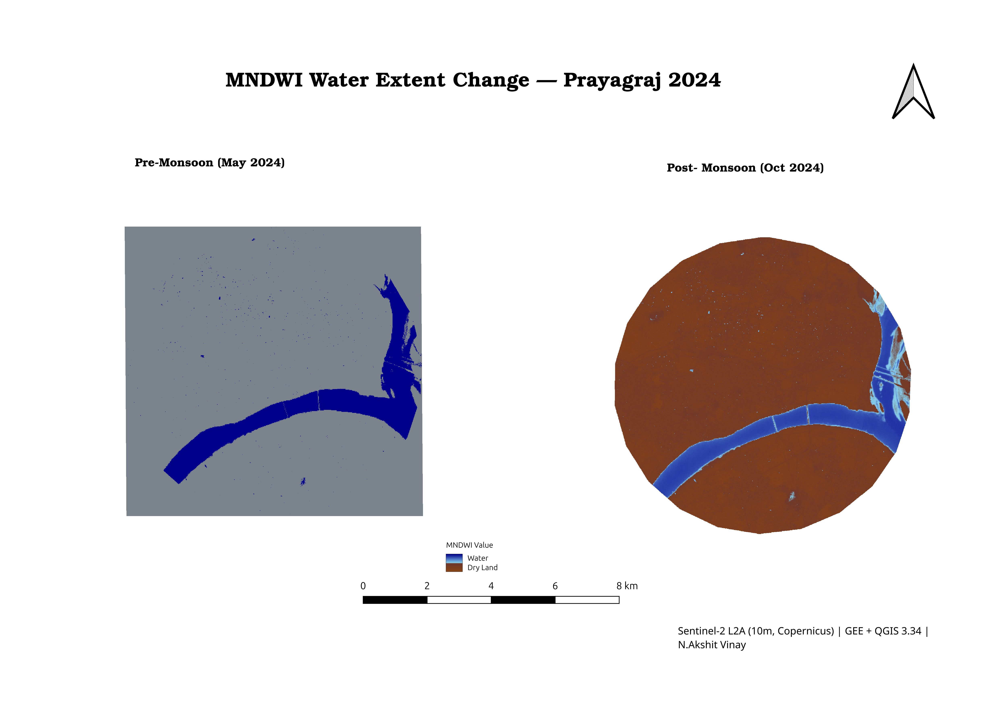
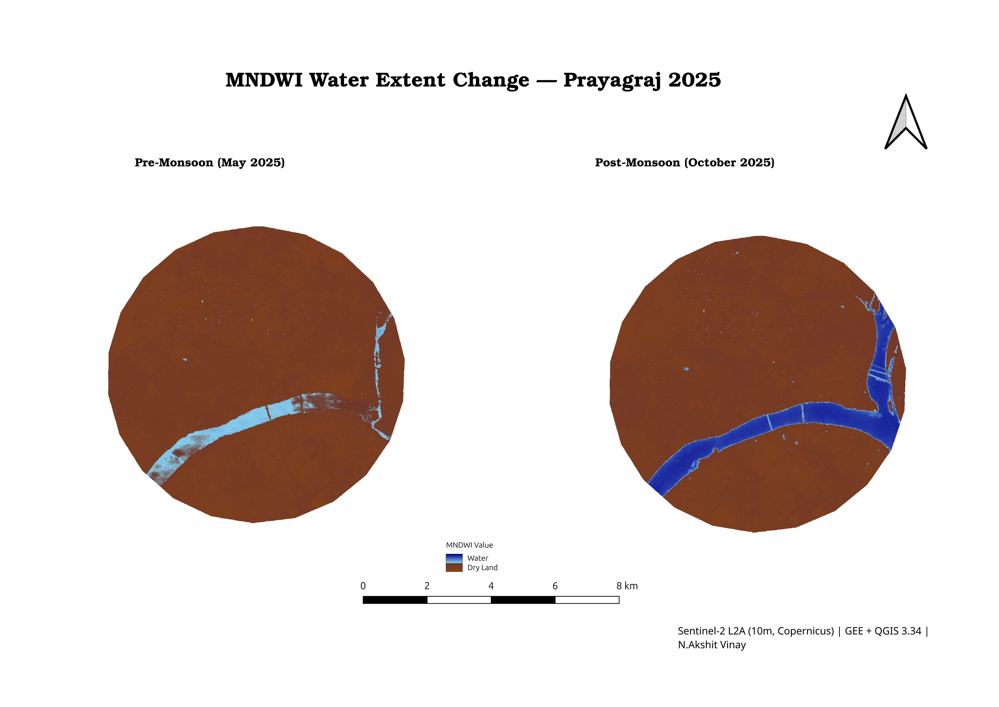
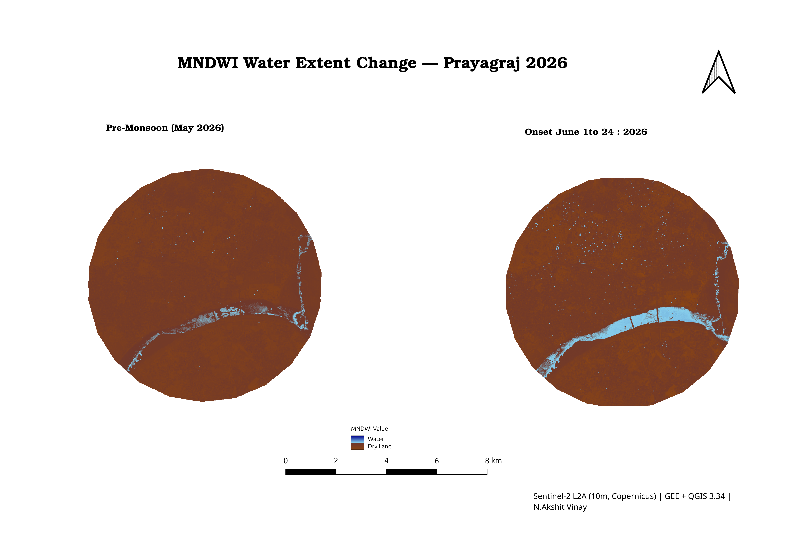

<p align="center">
  
</p>

<p align="center">
  
</p>

<p align="center">
  <a href="LICENSE"></a>
  
  
  
  
  
  
  
  
</p>

<p align="center">
  <strong>📍 Triveni Sangam, Prayagraj &nbsp;|&nbsp; 25.4358°N, 81.8463°E &nbsp;|&nbsp; Part of the MISSION400 Open Geospatial Series</strong>
</p>

---

## 📑 Table of Contents

| Section | |
|---|---|
| [🗺️ Maps](#️-maps) | [📊 Results & Key Findings](#-results--key-findings) |
| [📍 Study Area](#-study-area) | [🛰️ Data Sources](#️-data-sources) |
| [🔬 Methodology](#-methodology) | [📁 Repository Structure](#-repository-structure) |
| [🚀 Reproduce](#-reproduce) | [⚠️ Notes on Interpretation](#️-notes-on-interpretation) |
| [📜 License](#-license) | [👤 Author](#-author) |

---

## 🗺️ Maps

### 3-Year Comparison Grid — Pre vs Post Monsoon

<p align="center">
  
</p>

<p align="center"><em>MNDWI water maps for 2024, 2025, and 2026 at the Ganga-Yamuna confluence. Blue = open water (MNDWI > 0). Pre-monsoon (May) and post-monsoon panels shown side-by-side for each year. Sentinel-2 L2A, 10m resolution, strict &lt;5% cloud filter.</em></p>

---

### Year-by-Year Panels

<table>
<tr>
<td align="center" width="33%">
  <br/>
  <strong>2024</strong> — Pre (May) vs Post (Oct)<br/>
  <code>9.37 → 9.29 sq km</code>
</td>
<td align="center" width="33%">
  <br/>
  <strong>2025</strong> — Pre (May) vs Post (Oct)<br/>
  <code>3.08 → 8.35 sq km</code>
</td>
<td align="center" width="33%">
  <br/>
  <strong>2026*</strong> — Pre (May) vs Onset (Jun 1–24)<br/>
  <code>0.87 → 3.57 sq km</code>
</td>
</tr>
</table>

> **\*2026:** Onset-window reading only (Jun 1–24, 2026). Not directly comparable to full Oct peaks for 2024/2025.

---

## 📊 Results & Key Findings

### Water Extent Summary

| Year | Pre-Monsoon | Window | Post/Onset | Window | Δ (%) | Cloud Filter |
|:----:|:-----------:|:------:|:----------:|:------:|:-----:|:------------:|
| **2024** | **9.3708 sq km** | May 1–31 | 9.2937 sq km | Oct 1–31 | -0.82% | <5% |
| **2025** | **3.0834 sq km** | May 1–31 | 8.3452 sq km | Oct 1–31 | +170.65% | <5% |
| **2026\*** | **0.8725 sq km** | May 1–31 | 3.5675 sq km | Jun 1–24 | +308.88% | <5% |

### Pre-Monsoon Baseline Decline

```
2024 → 2025:  9.37 → 3.08 sq km   (-67.1%)
2025 → 2026:  3.08 → 0.87 sq km   (-71.7%)
──────────────────────────────────────────
2024 → 2026:  9.37 → 0.87 sq km   (-90.7% total)
```

### What the Pattern Shows

The **summer baseline keeps getting drier**, but the **monsoon response keeps getting sharper**. Each year the river recovers from a lower starting point — and recovers harder. 

- 2024: Monsoon adds almost nothing to an already-high base (−0.82%)
- 2025: Monsoon nearly triples a depleted pre-season base (+170.65%)
- 2026: Even a partial onset reading is already 4× the dry baseline (+308.88%)

> All figures are direct output from `reduceRegion`/pixel-area sums in the GEE script — not estimates. See [⚠️ Notes on Interpretation](#️-notes-on-interpretation) before drawing conclusions from a single AOI / 3-year window.

---

## 📍 Study Area

<table>
<tr><td><strong>Location</strong></td><td>Sangam (Triveni Sangam), Prayagraj, Uttar Pradesh, India</td></tr>
<tr><td><strong>Coordinates</strong></td><td>25.4358°N, 81.8463°E</td></tr>
<tr><td><strong>AOI</strong></td><td>5 km radius circular buffer (~78.5 sq km)</td></tr>
<tr><td><strong>CRS</strong></td><td>WGS 84 / UTM Zone 44N (EPSG:32644)</td></tr>
<tr><td><strong>Monsoon Type</strong></td><td>Southwest Monsoon (active June – September)</td></tr>
<tr><td><strong>Context</strong></td><td>Confluence of Ganga + Yamuna rivers — a major inland water body and pilgrimage site</td></tr>
</table>

---

## 🛰️ Data Sources

| Parameter | Value |
|:---|:---|
| **Satellite** | Sentinel-2 Level-2A (Surface Reflectance) |
| **GEE Collection** | `COPERNICUS/S2_SR_HARMONIZED` |
| **Spatial Resolution** | 10 m (Bands B3, B11) |
| **Scene Cloud Filter** | `CLOUDY_PIXEL_PERCENTAGE` < 5% |
| **Pixel Cloud Mask** | QA60 bits 10 (cloud) and 11 (cirrus) |
| **Compositing** | Median composite per analysis window |
| **Spectral Index** | MNDWI = `normalizedDifference(['B3', 'B11'])` |
| **Water Threshold** | MNDWI > 0 (binary water mask) |
| **Export Scale** | 10 m |
| **Data Provider** | ESA / Copernicus — [CC BY 4.0](https://creativecommons.org/licenses/by/4.0/) |

---

## 🔬 Methodology

```text
Step 1:  Define AOI
         → 5 km buffer around 25.4358°N, 81.8463°E (Triveni Sangam)

Step 2:  Filter Sentinel-2 L2A Collection
         → filterBounds(aoi)
         → filterDate(startDate, endDate)
         → CLOUDY_PIXEL_PERCENTAGE < 5%

Step 3:  Apply Per-Pixel Cloud Mask
         → QA60 bit 10 (cloud) = 0  AND  bit 11 (cirrus) = 0

Step 4:  Build Median Composite
         → .map(maskS2clouds).median().clip(aoi)

Step 5:  Compute MNDWI
         → normalizedDifference(['B3', 'B11'])
         → Formula: (Green − SWIR1) / (Green + SWIR1)

Step 6:  Derive Water Mask
         → MNDWI > 0  →  binary raster (1 = water, 0 = land)

Step 7:  Compute Water Area
         → pixelArea() × waterMask
         → reduceRegion(sum, aoi, scale=10)
         → area ÷ 1,000,000 = km²

Step 8:  Change Detection
         → preWater × 2 + postWater
         → 4-class output: 0=always dry, 1=new water, 2=lost water, 3=always water

Step 9:  Export GeoTIFFs
         → Export.image.toDrive
         → scale=10, CRS=EPSG:32644, folder='GEE_001A_Prayagraj_MultiYear'

Step 10: Post-processing in QGIS 3.34
         → Import GeoTIFFs → Polygonize (Raster → Conversion)
         → Filter water polygons → Calculate area → Export map layout
```

### Analysis Windows

| Period | Date Range | Type | Rationale |
|:---|:---|:---|:---|
| Pre-Monsoon 2024 | May 1–31, 2024 | Dry baseline | Minimum river extent before monsoon |
| Post-Monsoon 2024 | Oct 1–31, 2024 | SW monsoon peak | Maximum seasonal surface water |
| Pre-Monsoon 2025 | May 1–31, 2025 | Dry baseline | |
| Post-Monsoon 2025 | Oct 1–31, 2025 | SW monsoon peak | |
| Pre-Monsoon 2026 | May 1–31, 2026 | Dry baseline | |
| Monsoon Onset 2026 | Jun 1–24, 2026 | Partial onset | Oct 2026 data not yet available |

---

## 📁 Repository Structure

```
MNDWI-Water-Mapping-Prayagraj-2024-2026/
│
├── 📂 gee_scripts/
│   └── 001A_multiyear_2024_2025_2026.js   ← Full GEE script (run this to reproduce all numbers)
│
├── 📂 stats/
│   └── water_area_prayagraj.csv            ← All periods, raw water area output
│
├── 📂 maps/
│   ├── 001A_MNDWI_Prayagraj_3Year_Grid.png   ← 3-year side-by-side comparison (hero image)
│   ├── 001A_MNDWI_Prayagraj_2024.png          ← 2024 pre vs post panel
│   ├── 001A_MNDWI_Prayagraj_2025.png          ← 2025 pre vs post panel
│   └── 001A_MNDWI_Prayagraj_2026.png          ← 2026 pre vs monsoon onset panel
│
├── 📄 README.md
├── 📄 LICENSE  (MIT — code only)
└── 📄 .gitignore
```

> **Not in this repo (size):** Raw GeoTIFFs (~4MB each) and vector GeoPackages are stored locally. The GEE script is fully sufficient to reproduce them from scratch.

---

## 🚀 Reproduce

```bash
# ──────────────────────────────────────────────
# STEP 1 — Run the GEE Script
# ──────────────────────────────────────────────
# Open: https://code.earthengine.google.com
# New Script → paste: gee_scripts/001A_multiyear_2024_2025_2026.js
# Click RUN
# Console tab → read each period's water area (sq km)

# ──────────────────────────────────────────────
# STEP 2 — Export GeoTIFFs
# ──────────────────────────────────────────────
# Tasks tab → Run all export tasks
# Export folder: GEE_001A_Prayagraj_MultiYear
# Download from Google Drive

# ──────────────────────────────────────────────
# STEP 3 — Post-process in QGIS 3.34+
# ──────────────────────────────────────────────
# File → Open Project → drag GeoTIFFs
# Raster → Conversion → Polygonize (Raster to Vector)
# Vector → Geometry Tools → Area calculation
# Project → Import/Export → Export Map to Image

# ──────────────────────────────────────────────
# STEP 4 — Verify against provided CSV
# ──────────────────────────────────────────────
# Compare your console output against:
# stats/water_area_prayagraj.csv
```

> **Re-run note:** GEE composites are dynamic. Collection contents can shift slightly with late-arriving scenes, so re-running may produce marginally different values from those in `water_area_prayagraj.csv`. That CSV reflects the exact console output at analysis time.

---

## ⚠️ Notes on Interpretation

> Read these **before** citing these numbers anywhere.

| Caveat | Detail |
|:---|:---|
| **AOI scope** | A 5 km-radius circle captures a short stretch of the confluence — not the full Ganga-Yamuna basin. Local readings cannot be generalized to system-wide water availability without additional sites. |
| **Sample size** | 3 years = 3 data points. The pre-monsoon decline is a **real, measured pattern** in this AOI — but three points don't establish a long-term climate trend. Cross-check against CWC gauge data for stronger claims. |
| **Threshold sensitivity** | MNDWI > 0 is a simple, widely used cutoff but can misclassify wet sand, shadow, or turbid margins. Always visually verify water masks against the optical composite before using these figures beyond educational/illustrative purposes. |
| **2026 incompleteness** | The Jun 1–24 onset figure is **not** a seasonal peak and is **not** apples-to-apples with the Oct 2024/2025 readings. It is an early-season signal only. |
| **Median compositing** | Monthly median composites reduce cloud effects but may average out short-duration flood events. |

---

## 📜 License

| Component | License |
|:---|:---|
| Code (`gee_scripts/`) | [MIT](LICENSE) |
| Satellite data source | [CC BY 4.0](https://creativecommons.org/licenses/by/4.0/) — ESA / Copernicus |
| Maps & derived outputs | [CC BY 4.0](https://creativecommons.org/licenses/by/4.0/) |

---

## 👤 Author

<p align="center">
  <strong>N. Akshit Vinay</strong><br/>
  Open geospatial analyst · MISSION400 Series<br/>
  Mapping Indian water bodies and land surfaces with free satellite data and open-source GIS tools.
</p>

<p align="center">
  <em>Project 001A — part of an ongoing series. More AOIs, more years, more indices coming.</em>
</p>

---

<p align="center">
  
</p>

<p align="center">
  <sub>Open data · Open tools · Reproducible science</sub>
</p>
